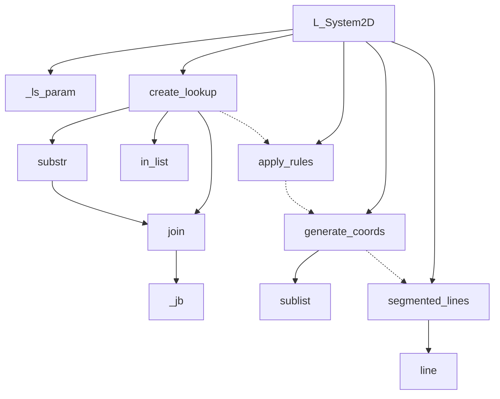

# l-system-scad

An L-system implementation in OpenSCAD. L-systems (Lindenmayer systems) are parallel rewriting systems and a type of formal grammar, commonly used to simulate plant growth and generate fractals.

## Overview

This library allows you to generate space-filling curves and fractal shapes by applying recursive replacement rules. The core functions have been optimized, significantly improving speed and reducing memory usage. New features such as support for the "M" move without drawing and position saving and restoring with "[" and "]" have also been added.

### Key Features

- **L-system functionality**: Create fractals and space-filling curves using recursive rule-based transformations.
- **Optimized core functions**: The library has been completely rewritten, now using half the memory and twice the speed of previous versions.
- **Turtle graphics support**: Movement operations include forward drawing ("F"), move without drawing ("M"), and rotation ("+" and "-").
- **Position saving and restoring**: Use "[" and "]" to save and restore the turtle's position and orientation during rule application.

## Operations Supported

- `"F"`: Moves the turtle forward by one unit and draws a line segment.
- `"M"`: Moves the turtle forward without drawing (useful for non-drawing paths, e.g., `island_curve` example).
- `"+"`: Rotates the turtle to the right by the specified angle (default is 90 degrees).
- `"-"`: Rotates the turtle to the left by the specified angle (default is 90 degrees).
- `"["`: Saves the current position and heading to the stack.
- `"]"`: Restores the position and heading from the stack.

If your L-system rules use different symbols than the default "F" for forward or "M" for move, you can specify custom characters using the `draw_chars` and `move_chars` parameters in `L_System2D`. An extensive range of examples can be found under `examples` folder.

## Usage

Render a predefined curve from the catalog (its curated defaults ride along in the grammar tuple; explicit arguments override them):

```scad
use <l-system-scad/l_systems.scad>;

L_System2D(dragon_curve());
L_System2D(gosper_curve(), n = 3, w = 0.6);
linear_extrude(2) L_System2D(hilbert_curve(), n = 6, w = 1);
```

Define a custom grammar (the catalog is not needed):

```scad
use <l-system-scad/l_system_2d.scad>;

L_System2D("FX", [ "X=X+YF+", "Y=-FX-Y" ], n = 12, angle = 90, w = 0.4);
```

Override library settings — these are `$`-special variables, so they work through `use`, per call or globally:

```scad
use <l-system-scad/l_systems.scad>;

$ls_rounded = false; // no rounded joints/caps (faster preview)
$ls_debug = true;    // echo intermediate tables/instructions/coords
$fn = 8;             // cap tessellation (library default: 16)

L_System2D(fractal_plant(), $ls_rounded = true); // per-call override
```

## Architecture

- **`l_systems.scad`** — umbrella entry point: includes the engine and the grammar catalog.
- **`l_system_core.scad`** — dimension-agnostic rewriting engine (`create_lookup`, `apply_rules`, helpers). Shared by the 2D and future 3D interpreters.
- **`l_system_2d.scad`** — the 2D turtle interpreter and renderer (`L_System2D`, `generate_coords`, `segmented_lines`, `line`).
- **`grammars.scad`** — pure-data curve catalog: each curve is a function returning a grammar tuple `[axiom, rules, params]`, where `params` is a list of `[key, value]` pairs carrying the curve's curated defaults (`angle`, `n`, and where non-default: `w`, `draw_chars`, `move_chars`, `heading`, `poly`).

Every file contains only definitions (no top-level state), so each is standalone and works identically via `use` or `include`.

- **_Modules_**
  - **L_System2D**: High-level module for generating an L-system based model. Accepts `(axiom, rules, ...)` or a grammar tuple.
  - **segmented_lines**: Draws line segments from coordinates.
  - **line**: Draws a single line segment.
- **_Functions_**
  - **create_lookup**: Creates lookup tables for rule replacement.
  - **apply_rules**: Applies L-system rules recursively.
  - **generate_coords**: Converts instructions into coordinates.
  - **\_ls_param**: Looks up a key in a grammar tuple's params list.
  - **join**: Efficiently joins lists using a binary tree method.
  - **\_jb**: Recursively joins list elements using a binary split.
  - **substr**: Extracts a substring from a string.
  - **sublist**: Extracts a sublist from a list.
  - **in_list**: Checks if a value exists in a list.



## Development

### Changelog Highlights

- **Pure-data grammar catalog**: predefined curves are now plain functions returning `[axiom, rules, params]` tuples; the per-curve wrapper modules were removed. `dragon_curve(n = 12)` becomes `L_System2D(dragon_curve(), n = 12)`.
- **`$ls_*` settings**: the `USER_ROUNDED`/`USER_FN`/`USER_DEBUG` include-only override pattern was replaced by dynamically scoped `$ls_rounded`/`$ls_debug` special variables that also work through `use` and per call. The library no longer sets `$fn` globally.
- **New operations**: The library now supports the `"M"` move without drawing and position-saving/position-restoring brackets (`[` and `]`).
- **Performance improvements**: The core functions have been optimized for speed and memory efficiency, offering better performance for larger iterations.
- **Rule format update**: Rules are now simpler and more flexible, taking the form of a single string per rule, e.g., `"X=ABC"`.
- **Expanded examples**: Large number of new example curves and models were added to demonstrate the added features.

### Future Work

- Attempt at 3D modelling of L Systems

## Notes

The models generated by this library can increase in complexity exponentially with higher iteration values. Be cautious with increasing the value of 'n', as large values may cause the program to hang or consume large amounts of memory (RAM). A recommended maximum 'n' value has been provided for each curve, with limitations due to OpenSCAD's 1,000,000 iteration limit for "C-style" for loops.

### Curves

All generated shapes are currently 2D. It's recommended to **USE F6 RENDER** to view each curve, as this provides better performance compared to F5 rendering.

For more details on L-systems, visit [L-System Wikipedia](https://en.wikipedia.org/wiki/L-system).

## Acknowledgment

This is an extension and modularized version of [L-system OpenSCAD Library by Hans Loeblich](https://gist.github.com/thehans/a1494db8046a58832e2ebb10a5908a66).
I would like to express my gratitude to Hans for his invaluable contributions to the OpenSCAD community which have been instrumental in shaping many of my own libraries and designs in OpenSCAD. Also to [tecnoloxia](https://github.com/tecnoloxia) who contributed lots of examples through their 100hex project.
