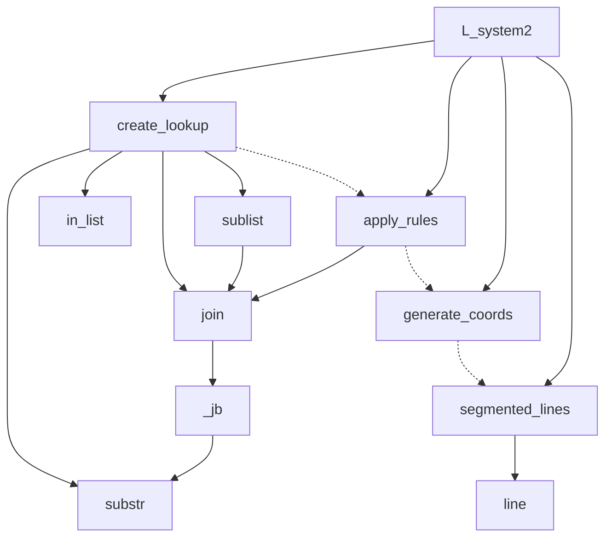

# Docs

Welcome to da docs!

The below diagram gives an idea of the logical flow of the program.

```mermaid
graph TD
  L_system2 --> create_lookup
  L_system2 --> apply_rules
  L_system2 --> generate_coords
  L_system2 --> segmented_lines

  create_lookup --> substr
  create_lookup --> in_list
  create_lookup --> join

  apply_rules --> join

  segmented_lines --> line

  join --> _jb 

  _jb --> substr
  sublist --> join

  create_lookup --> sublist

  create_lookup -.-> apply_rules
  apply_rules -.-> generate_coords 
  generate_coords -.-> segmented_lines
```
