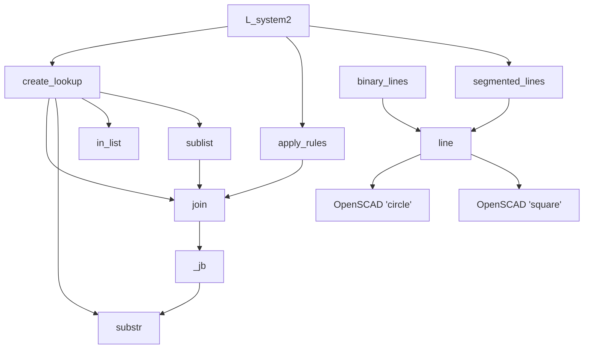

# Docs

Welcome to da docs!

```mermaid
graph TD
  L_system2 --> create_lookup
  L_system2 --> apply_rules
  L_system2 --> segmented_lines

  create_lookup --> join
  create_lookup --> substr
  create_lookup --> in_list

  apply_rules --> join

  segmented_lines --> line

  join --> _jb

  _jb --> substr
  sublist --> join

  binary_lines --> line

  line --> circle["OpenSCAD 'circle'"]
  line --> square["OpenSCAD 'square'"]

  create_lookup --> sublist

```
