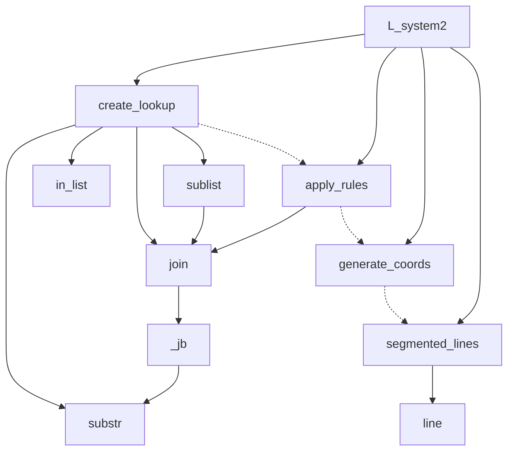

# Docs

Welcome to da docs!

The below diagram gives an idea of the logical flow of the program. Summary:

- **_Modules_**
  - **L_System2**: High-level module for generating an L-system based model.
  - **segmented_lines**: Draws line segments from coordinates.
  - **line**: Draws a single line segment.
- **_Functions_**
  - **create_lookup**: Creates lookup tables for rule replacement.
  - **apply_rules**: Applies L-system rules recursively.
  - **generate_coords**: Converts instructions into coordinates.
  - **join**: Efficiently joins lists using a binary tree method.
  - **\_jb**: Recursively joins list elements using a binary split.
  - **substr**: Extracts a substring from a string.
  - **sublist**: Extracts a sublist from a list.
  - **in_list**: Checks if a value exists in a list.

